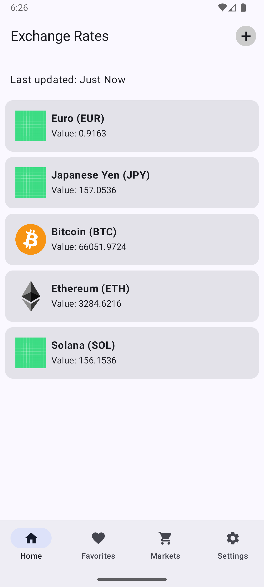
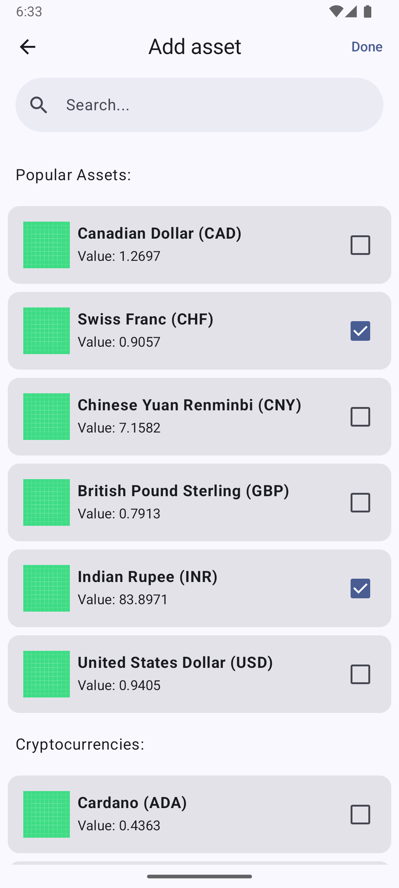
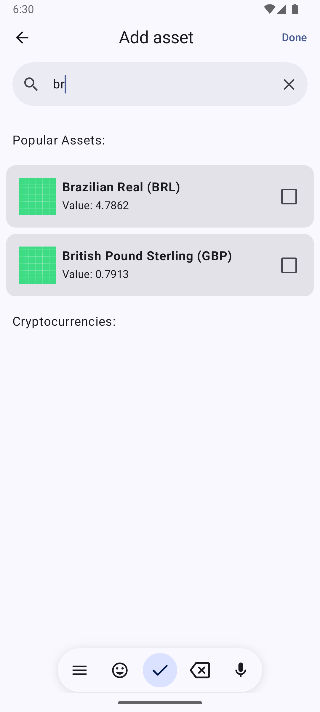

# Mobile Engineer Assignment: Real-Time Exchange Rate Tracker

## Objective

Create a mobile application that displays real-time exchange rates for a list of selected currencies or assets[cite: 1]. Users should be able to add and remove currencies/assets from their personalized board[cite: 2]. The app should update prices automatically in near real-time[cite: 3].

## Requirements

### Functional

1.  **Home Screen:** Displays a list of selected assets (e.g., USD, EUR, BTC) and their current exchange rates[cite: 4].
    * A fake dataset of 20 assets was generated[cite: 5].
    * Exchange rates auto-update. A fake repository simulates API updates with randomized values since free APIs didn't support 3-5 second updates[cite: 6].
      
2.  **Add Asset Screen:** A searchable screen to browse and add available currencies/assets to the board[cite: 7].
    * Implemented selection of multiple currencies at once, sorted by whether they are cryptocurrencies[cite: 8].
    * Only assets not already on the board are shown[cite: 9].
    * Selected assets persist between sessions using Room DB[cite: 10, 11]. Data is backed by the database, following the "Single source of truth" pattern[cite: 12].
      
      
3.  **Remove Asset:** Users can remove assets from their list[cite: 13]. Removed assets become available again on the "Add Asset" screen[cite: 14].

### Data Source

* A mock API was created to emulate the required 3-5 second refresh rate behavior, as publicly available free APIs researched (e.g., OpenExchangeRates, ExchangeRate.host, CoinGecko, ECB rates) did not offer this frequency[cite: 6, 15, 16, 18].

### Tech Stack

* **Language/Framework:** Kotlin with Jetpack Compose[cite: 23].
* **Architecture:** MVVM[cite: 21].
* **Database:** Room DB for persistence and offline support[cite: 10, 12, 22].
* **Backend:** None required; client-only solution[cite: 24].

### Bonus Points Implemented

* **Animations:** "Swipe to remove" mechanism implemented[cite: 18].
* **Error Handling:** Proper error handling for simulated API issues, displaying Toast messages with details[cite: 19, 20].
* **Testing:** Basic unit/UI testing included[cite: 21].
* **Offline Support:** Last known rates are available offline due to Room DB integration[cite: 22].

## Setup Instructions

* The API is mocked within the application[cite: 25]. No external API setup is needed[cite: 26].

## Assumptions Made

* Due to limitations with free real-time data sources providing 3-5 second updates, a fake repository was implemented to simulate this behavior[cite: 6, 16].

## Submission

* Code uploaded to GitHub[cite: 25].
* Screenshots added (optional)[cite: 25].

## Estimated Time vs. Actual Time

* **Estimated:** 4–6 hours[cite: 27].
* **Actual:** Approximately 12 hours[cite: 27].

